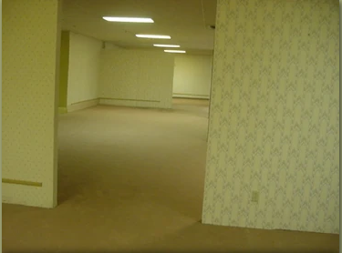

En 2019 se abrió un hilo de conversación en 4Chan, un foro de internet dónde los usuarios pueden postear una foto con un comentario y con eso se crea un hilo (Thread en inglés). Este hilo era distinto a los demás ya que un usuario pedía a los demás miembros que colgaran fotos que causaran terror. De repente un usuario subió una foto al hilo de la conversación, en concreto esta:

Esta imagen causó bastante inquietud a los usuarios del foro, ya que parecen [[2. Los Backrooms]], fue ahí dónde realmente se empezó a investigar sobre este tema más profundamente.

La gente empezó a investigar sobre esto e independientemente empezaron a buscar de dónde se había hecho la foto.

A finales de mayo de 2024 finalmente se descubrió realmente de dónde procedía esta imagen mediante el uso de herramientas como **ExifTool**, para extraer metadatos de imágenes. *Actualmente se considera uno de los mayores misterios resueltos de la historia de Internet.*

Se descubrió que esta imagen ya corría por internet desde 2012 en otro hilo pero no había tenido tanto impacto como en 2019.  Cada vez había más usuarios interesados en el tema así que la búsqueda se fue profundizando hasta llegar a resolver este misterio. La gente empezó a analizar la imagen profundamente, desde el modelo de papel que tenía la pared, las medidas del salón, etc. Se llegaron a crear canales de Discord para discutir y llegar a la solución final a nivel mundial.

Finalmente se descubrió que la foto fue tomada en 2002 con una cámara de fotos Sony, en una tienda de muebles de E.E.U.U dónde iba a ser restaurada para crear un salón de carreras de coches teledirigidos. Durante la restauración se realizaron varias imágenes, entre ellas la que podemos ver en este artículo.

La gente conoció el verdadero origen de la imagen, en una tienda de muebles normal y corriente, pero se profundizo la búsqueda e investigación sobre lo que eran realmente [[2. Los Backrooms]]

