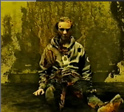

Cada vez eran más internautas que investigaban sobre este *"creepypasta"* y buscando en Internet encontré el Proyecto V-31, un programa de ingeniería dimensional desarrollado por la Fundación A-Sync en al década de 1980 con el objetivo de crear almacenamiento y espacio ilimitado. El proyecto fue financiado por el gobierno de los Estados Unidos, en concreto el Departamento de Energía que implemento el [[Sistema de distorsión magnética de baja proximidad]] también conocido como LPMDS. 

El experimento se realizó en California, en una de las instalaciones de ASYNC. También referenciaban esta proyecto como **"La Máquina"** o **"La Puerta"** O **"Hallways"**.

Vídeo explicativo: https://www.youtube.com/watch?v=nzcpTqfeeCM
## Primer Contacto

El experimento tuvo éxito el 17 de octubre de 1989, cuando durante la sexta prueba del Proyecto KV-31, de repente apareció un vasto complejo de habitaciones en el umbral del [[Sistema de distorsión magnética de baja proximidad]]

## A-SYNC

El instituto de Investigación A-SYNC es una organización de investigación que abrió el [[Sistema de distorsión magnética de baja proximidad]] para poder acceder a los Backrooms.

En abril de 1988, Async comenzó un experimento sobre la apertura de una puerta hacia [[The Backrooms]] basada en la investigación del Laboratorio Nacional de Ridge. Los experimentos fueron dirigidos por el vicedirector Ivan Beck y fueron descritos como una solución para futuras necesidades de almacenamiento y viviendas sin tener problemas de espacio y dimensiones. Los experimentos continuaron a medida que conseguían fondos del gobierno.

Poco después de conseguir abrir el Umbral para acceder a [[The Backrooms]] comenzaron a explorar y documentar sobre el experimento. 

## Hallazgos del Proyecto 

El 3 de febrero de 1990, un equipo de investigación de A-SYNC encontró un cadáver en descomposición con moho que crecía a su alrededor, se le hizo una autopsia llegando a la conclusión de que era Nicolas Bolton.

Nicolas Bolton fue una de las muchas personas que desapareció al caer en [[The Backrooms]] después de que el umbral fuera abierto por el Instituto de Investigación Async. Tenía entre 18 y 20 años y vivía en el noroeste de California. Estaba atrapado allí hasta que murió como resultado de la desnutrición alrededor del 31 de enero de 1990.  Se sentó por una pared no muy lejos del Umbral. Un moho negro comenzó a crecer rápidamente por todo su cuerpo. La mayoría de las partes de su cadáver se descomponían normalmente, pero algunas partes permanecían sostenibles. Investigadores de Async descubrieron el cuerpo de Nicolas y lo llevaron a las instalaciones. No pudieron especificar su identidad, así que se le refirió como "John Doe".

