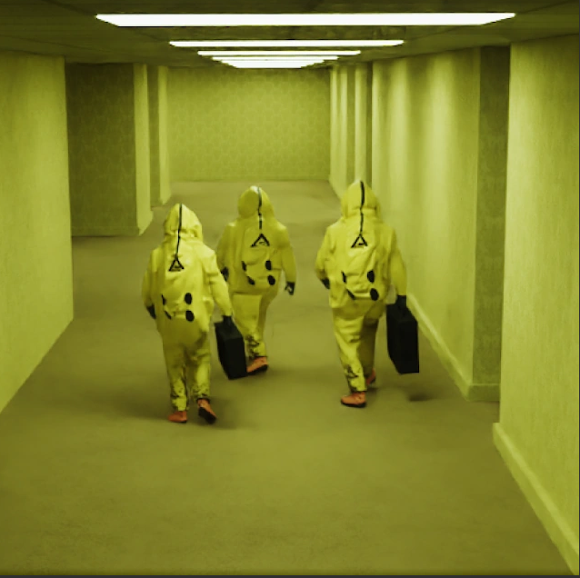

**The Backrooms** es un **creepypasta** que describe un laberinto interminable de oficinas y otros ambientes generados aleatoriamente. Realmente se desconoce quién creó la historia. Desde su creación original, los backrooms se han expandido a varias formas de miedo y cultura de Internet, incluidos los videojuegos y YouTube.

El origen de los backrooms surge de una publicación de 4chan explicada en otro punto de este artículo: [[Por qué los descubrí]]. A partir de la aparición de la imagen en este foro, la imagen fue un misterio debido a falta de información de la misma, de manera que muchos usuarios de Internet escribieron historias de terror relacionadas con los Backrooms. Además, se crearon y compartieron muchos memes en las redes sociales, de manera que el tema se fue popularizando cada vez más.

Al no tener suficiente información sobre la imagen el tema cada vez más tenia más sinergias y teorías, de las cuales la mayoría de ellas eran ficticias pero mucha gente se interesaba por ellas y empezó a investigar sobre ello.

En este artículo veremos en detalle toda la información que hay en Internet sobre este CreepyPasta y conoceremos en detalle los experimentos realizados (Se desconoce si son reales o fictícios) que están publicados. Adicionalmente se explicará el método o sistema para poder acceder a ellos.

En términos sencillos, [[The Backrooms]] son espacios virtuales que recrean ambientes surreales, a menudo con un aspecto de oficinas o pasillos que parecen interminable.

Los puntos a tratar son los siguientes:
- [[Proyecto KV31]]
- [[Sistema de distorsión magnética de baja proximidad]]
- [[Por qué los descubrí]]
